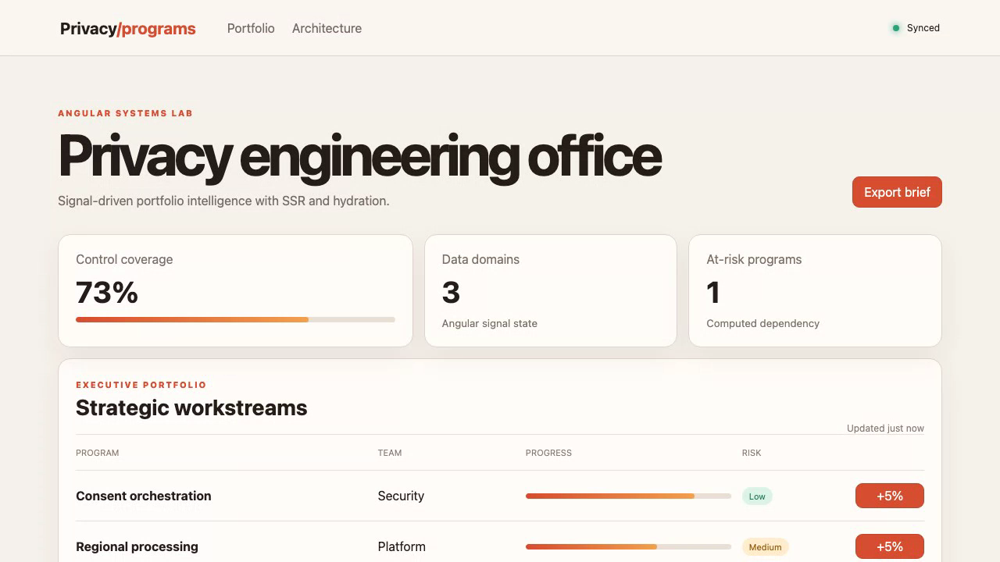

# Privacy Control Plane

Privacy Control Plane helps organisations understand where personal information is used and whether it is protected.

## Live demo

[Watch the recorded product demonstration](docs/demo.webm)

This recording shows the real product running and demonstrates its main screens and actions.

## Screenshots



## Main features

- See which services use personal information.
- Find missing privacy checks.
- Review how information moves between services.
- Assign work to the right team.
- Track improvements and readiness.

## Technology used

- Angular with strict TypeScript.
- Angular CLI for local development and production builds.
- Java with Spring Boot for the backend.
- Maven for Java builds.
- Angular tests and JUnit for automated checks.

## Installation instructions

You need Node.js 20 or newer, Java 21 or newer, and Maven 3.9 or newer.

Install the frontend packages:

```bash
npm ci
```

Run all automated checks and production builds:

```bash
npm test
npm run build
npm run backend:test
npm run backend:build
```

Start the frontend and Java backend together:

```bash
npm run fullstack
```

Open [http://localhost:4200](http://localhost:4200) for the product. The Java API runs at [http://localhost:8080](http://localhost:8080).

## Commercial licensing/contact

No commercial license is granted automatically. For commercial licensing, integration work, consulting, or partnership enquiries, contact [Amitesh2022 through GitHub](https://github.com/Amitesh2022).

## Business problem and users

Privacy Control Plane helps organisations understand where personal information is used and whether it is protected. It is useful for privacy teams, service owners, risk teams, and managers.

## Key workflows

- See which services use personal information.
- Find missing privacy checks.
- Review how information moves between services.
- Assign work to the right team.
- Track improvements and readiness.

## Angular highlights

The product uses Angular to organise separate pages, forms, checks, and shared information. Forms warn users when information is missing. Automated checks and a production build confirm that the product works correctly.

## Java backend highlights

The Java backend uses Spring Boot. It provides real API endpoints to list, search, and create privacy review records. It checks incoming information, returns clear errors, exposes a health check, and includes automated Java tests.

## Architecture and state flow

The browser application calls the Java API on port 8080. The Java service checks the request and keeps the shared product information. After a user creates a record, the API returns the saved result and the browser refreshes the list.

## Accessibility and responsive behaviour

Buttons, forms, and links can be used with a keyboard. Labels explain what each field does, and important information is shown with words, not only colours. The layout also adjusts for tablets and phones.
